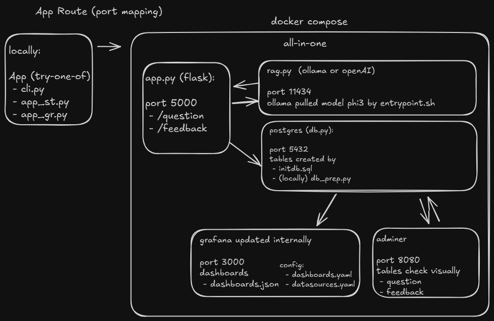
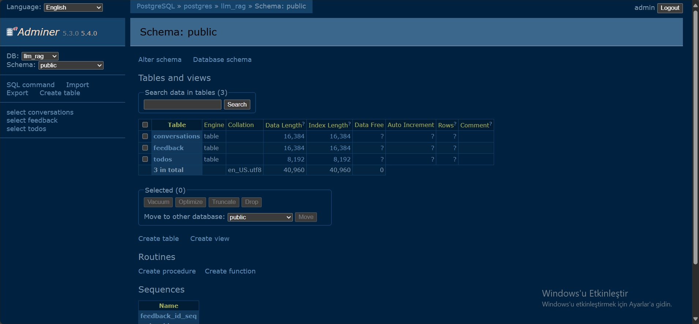
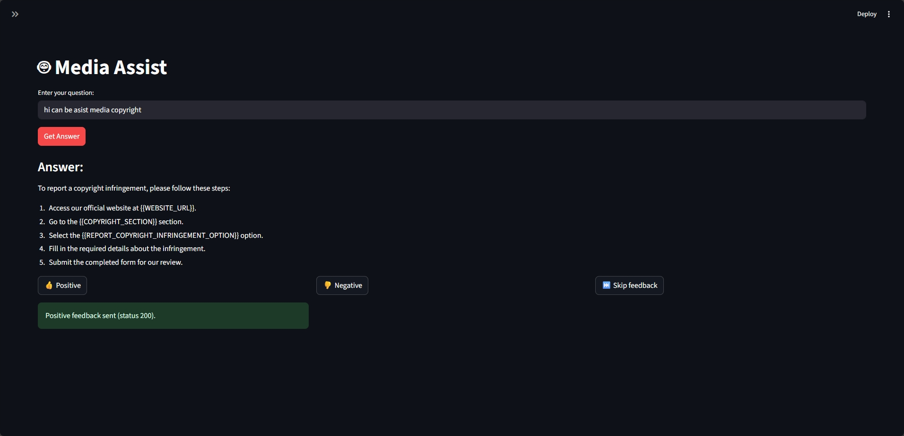
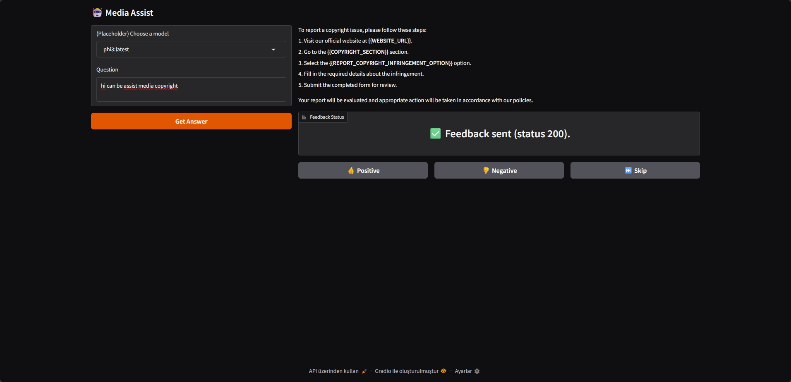
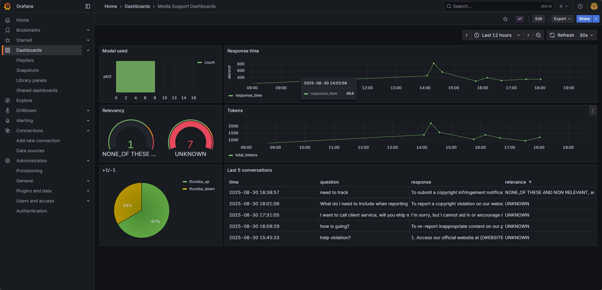

# 📺 Media Support Assistant  

> AI-powered assistant for customer support in the media domain.  
> Built with **RAG**, **LLMs**, and monitoring via **Grafana + PostgreSQL**.  

Providing timely and effective media support can be challenging, especially for small businesses with limited resources. Hiring full-time support staff isn't always feasible, and responding to every inquiry promptly can be overwhelming.  


**Media Support Assistant** is a conversational AI that helps businesses manage customer queries efficiently. It suggests responses, automates common inquiries, and improves customer satisfaction, making support more accessible and scalable.  


This project was developed as part of the **[LLM Zoomcamp](https://github.com/DataTalksClub/llm-zoomcamp)**, a free course focused on Large Language Models (LLMs) and Retrieval-Augmented Generation (RAG).  


## Project Overview

The **Media Support Assistant** is a RAG application designed to help businesses streamline their customer support processes.

**Main Use Cases:**

- 🤖 **Automated Responses:** Recommending accurate and context-aware responses based on customer queries.  
- 🧩 **Query Resolution:** Providing alternative solutions for common media issues.  
- 📚 **Guided Instructions:** Offering step-by-step guidance to resolve specific problems or troubleshoot products.  
- 💬 **Conversational Interaction:** Allowing users to get instant support without navigating complex documentation or waiting for human assistance.
- 📊 **Monitoring** – Grafana dashboards for conversations, feedback, and performance.  


## 📂 Dataset

The dataset used in this project is the [Bitext Media LLM Chatbot Training Dataset](https://huggingface.co/datasets/bitext/Bitext-media-llm-chatbot-training-dataset).

This dataset plays a crucial role in training the Media Support Assistant to handle a wide range of customer service queries, providing accurate and context-aware responses.

You can load it directly with Python:
```python
import pandas as pd

df = pd.read_csv("hf://datasets/bitext/Bitext-media-llm-chatbot-training-dataset/bitext-media-llm-chatbot-training-dataset.csv")
df.head()
```

### Fields of the Dataset

Each entry contains the following fields:

- **tags**: optional language generation tags
- **instruction**: A user request from the Media domain.
- **category**: High-level semantic category for the intent.
- **intent**: Specific intent type corresponding to the instruction.
- **response**: Example of the expected response reply from the virtual assistant.

### Categories and Intents

The dataset covers these categories and intents:

- **CONTACT**: `customer_service`, `human_agent`
- **CONTENT**: `report_copyright_infringement`, `report_inappropriate_content`
- **FUNCTIONING**: `devices`, `general_use`, `quickstart_guide`
- **PAYMENT**: `payment_methods`, `pay`, `report_payment_issue`
- **PLATFORM**: `fees`
- **PROGRAM_SCHEDULE**: `program_schedule`, `releases`
- **SETTINGS**: `change_language`, `change_subtitle_language`, `parental_control`, `recover_password`
- **SUBSCRIPTION**: `cancel_subscription`, `change_subscription`, `free_trial`, `premium_subscription`, `renew_subscription`, `subscribe`, `subscription`, `subscription_prices`

Entities

Entities in the dataset include:
- **{{WEBSITE_URL}}** – common to all intents
- **{{DEVICE_PLATFORM}}** – relevant to language or subtitle settings
- **{{PROGRAM_TYPE}}** – relevant to schedule or releases
- **{{LANGUAGE_OPTION}}** – relevant to language/subtitle changes
- **{{PAYMENT_METHODS_INFORMATION}}** – relevant to payment-related queries


## 🛠️ Tech Stack

- **Python 3.12**: Used as the primary programming language.
- **Streamlit / Gradio / CLI** – Interfaces
- **Docker & Docker Compose**: Service orchestration (containerization and managing services).
- **Flask**: Serves as the API interface (see [Background](#background) for more information on Flask).
- **Ollama/OpenAI**: Utilized as the Large Language Model (LLM) for generating responses.
- **Minsearch**: For full-text search functionality lightweight in-memory search engine.
- **PostgreSQL**: The backend database used for Grafana.
- **Grafana**: Used for monitoring dashboard system performance.


## Preparation Auto Docker (🐳 all-in-one)

### Running with Docker Compose

<!--  -->
<p align="center">  </p>

The easiest way to run the application is with legacy `docker-compose` or `docker compose`:

```bash
# (Recommended) start all services (app, postgres, grafana)
docker compose up -d
```

```bash
# Stop all services
docker compose down
```

If you want to run the application locally,
start only postres and grafana:

```bash
# Run only monitoring stack
docker compose up postgres grafana
```

If you previously started all applications with
`docker compose up`, you need to stop the `app`:

```bash
docker compose stop app
```

### Running App locally

For dependency management, we use pipenv, so you need to install it:

```bash
pip install pipenv
```

Once installed, you can install the app dependencies:

```bash
pipenv install --dev
```

Now run the app on your host machine:

```bash
# activate venv
pipenv shell

cd assistant

# export POSTGRES_HOST=localhost
python add_sample.py  # load example data
```

### (Optionally) 🔑 Preparation OpenAI

Since If use `OpenAI`, you need to provide the API key:

1. Install `direnv`. If you use Ubuntu, run `sudo apt install direnv` and then `direnv hook bash >> ~/.bashrc`.
2. Copy `.envrc_template` into `.envrc` and insert your key there.
3. For OpenAI, it's recommended to create a new project and use a separate key.
4. Run `direnv allow` to load the key into your environment.

```bash
sudo apt install direnv
direnv hook bash >> ~/.bashrc
```
```bash
cp .envrc_template .envrc
# edit and add OPENAI_API_KEY=your_key and other environment variables
direnv allow
```

## (If Neccessary) Running the application


<!--  -->
<p align="center">  </p>

### 🗄️ Database configuration

Before the application starts for the first time, the database
needs to be initialized.

First, run `postgres`:

```bash
docker-compose up postgres
```

(If Neccessary) Then run the [`db_prep.py`](assistant/db_prep.py) script:

```bash
pipenv shell

cd assistant

export POSTGRES_HOST=localhost
python db_prep.py
```

To check the content of the database, use `pgcli` (already
installed with pipenv):

```bash
pipenv run pgcli -h localhost -U your_username -d media_assistant -W
```

You can view the schema using the `\d` command:

```sql
\d conversations;
```

And select from this table:

```sql
select * from conversations;
```


## 🖥️ Interfaces: Using the application

When the application is running, we can start using it.


### App UI Streamlit 

To run the streamlit app:

```bash
# streamlit run app_st.py
pipenv run streamlit run app_st.py
```

You can now view your Streamlit app in your browser.

<p align="center">
  
</p>


### (Optionally) App UI Gradio 

To run the gradio app:

```bash
pipenv install gradio
```
```bash
# python app_gr.py
pipenv run python app_gr.py
```

You can now view your Gradio app in your browser.

<p align="center">
  
</p>


### App via CLI

We built an interactive CLI application using
[questionary](https://questionary.readthedocs.io/en/stable/).

To start it, run:

```bash
# python cli.py
pipenv run python cli.py
```

You can also make it randomly select a question from
[our ground truth dataset](data/ground-truth-data.csv):

```bash
# python cli.py -r
pipenv run python cli.py --random
```

### API via Requests `requests`

When the application is running, you can use
[requests](https://requests.readthedocs.io/en/latest/)
to send questions—use [test_app_requests.py](test_app_requests.py) for testing it:

```bash
# python test_app_requests.py
pipenv run python test_app_requests.py
```

It will pick a random question from the ground truth dataset
and send it to the app.

### Using `CURL`

You can also use `curl` for interacting with the API:

See: Makefile

```bash
make help
```

## Monitoring `Grafana`

We use Grafana for monitoring the application. 

It's accessible at [localhost:3000](http://localhost:3000):

- Login: `admin`
- Password: `admin`

### Dashboards `Grafana`

<p align="center">  </p>

The monitoring dashboard contains several panels:

1. **Last 5 Conversations (Table):** Displays a table showing the five most recent conversations, including details such as the question, response, relevance, and timestamp. This panel helps monitor recent interactions with users.
2. **+1/-1 (Pie Chart):** A pie chart that visualizes the feedback from users, showing the count of positive (thumbs up) and negative (thumbs down) feedback received. This panel helps track user satisfaction.
3. **Relevancy (Gauge):** A gauge chart representing the relevance of the responses provided during conversations. The chart categorizes relevance and indicates thresholds using different colors to highlight varying levels of response quality.
4. **Tokens (Time Series):** Another time series chart that tracks the number of tokens used in conversations over time. This helps to understand the usage patterns and the volume of data processed.
5. **Model Used (Bar Chart):** A bar chart displaying the count of conversations based on the different models used. This panel provides insights into which AI models are most frequently used.

### (If Neccessary) Setting up Grafana

All Grafana configurations are in the [`grafana`](grafana/) folder:

- [`dashboard.json`](grafana/dashboard.json) - the actual dashboard (taken from LLM Zoomcamp without changes).
- [`init.py`](grafana/init.py) - (If Neccessary) for initializing the datasource and the dashboard.

To initialize the dashboard, first ensure Grafana is
running (it starts automatically when you do `docker-compose up`).

Then run:

```bash
pipenv shell

cd grafana

env | grep POSTGRES_HOST

python init.py
```

Then go to [localhost:3000](http://localhost:3000):

- Login: `admin`
- Password: `admin`

When prompted, keep "admin" as the new password.


## 📦 Project Structure Code:


```bash
assistant/
  ├── app.py                    # Flask API
  ├── rag.py                    # RAG pipeline
  ├── ingest.py                 # Ingest data into Minsearch
  ├── db.py                     # Database logic
  ├── db_prep.py                # Optional init DB schema
  ├── minsearch.py              # In-memory search engine
  ├── test_app.py               # DB connection test
  └── ...
ollama/
  └── entrypoint.sh             # Ollama pull phi3 model
initdb/
  └── initdb.sql                # Postgres init DB schema
grafana/
  ├── dashboards 
  |   └── dashboards.json       # Dashboard definition
  └── provisioning
      ├── dashboards
      |   └── dashboards.yaml   # Dashboard config
      └── datasources
          └── datasources.yaml  # Datasource config
notebooks/
  ├── data_preparation.ipynb
  ├── ground-truth-data.ipynb
  └── rag-test.ipynb
```


The code for the application is in the [`assistant`](assistant/) folder:

- [`app.py`](assistant/app.py) - the Flask API, the main entrypoint to the application
- [`test_app.py`](assistant/test_app.py) - the script to test database connection
- [`rag.py`](assistant/rag.py) - the main RAG logic for building the retrieving the data and building the prompt
- [`ingest.py`](assistant/ingest.py) - loading the data into the knowledge base
- [`minsearch.py`](assistant/minsearch.py) - an in-memory search engine
- [`db.py`](assistant/db.py) - the logic for logging the requests and responses to postgres
- [`db_prep.py`](assistant/db_prep.py) - the script for initializing the database

We also have some code in the project root directory:

- [`test_app_requests.py`](test_app_requests.py) - select a random question for testing
- [`cli.py`](cli.py) - interactive CLI for the APP

### Interface

We use Flask for serving the application as an API.

Refer to the ["Using the Application" section](#using-the-application)
for examples on how to interact with the application.

### Ingestion

The ingestion script is in [`ingest.py`](assistant/ingest.py).

Since we use an in-memory database, `minsearch`, as our
knowledge base, we run the ingestion script at the startup
of the application.

It's executed inside [`rag.py`](assistant/rag.py)
when we import it.

## Experiments

For experiments, we use Jupyter notebooks.
They are in the [`notebooks`](notebooks/) folder.

To start Jupyter, run:

```bash
cd notebooks
pipenv run jupyter notebook
```

We have the following notebooks:

- [`data_preparation.ipynb`](notebooks/data_preparation.ipynb): to prepare a Media support training dataset (`~400` sample) by filtering, transforming, and saving the data into a structured format suitable for our RAG flow.
- [`ground-truth-data.ipynb`](notebooks/ground-truth-data.ipynb): Generating the ground truth dataset (~400x5) by ollama phi3 model (`https://ollama.com/library/phi3`) for retrieval evaluation.
- [`rag-test.ipynb`](notebooks/rag-test.ipynb): The RAG flow and evaluating  OpenAI’s `gpt-oss-120b` model (`https://huggingface.co/openai/gpt-oss-120b`) the system.

### Retrieval evaluation

The basic approach - using `minsearch` without any boosting - gave the following metrics:

- Hit rate: 4.5%
- MRR: 1.5%

The improved version (with tuned boosting):

- Hit rate: 6.4%
- MRR: 2.1%

The best boosting parameters:

```python
boost = {
 'intent': 4.709344164326785,
 'question': 0.9312117423908761,
 'response': 5.71511647366386,
 'category': 9.689631225548114,
}
```

### RAG flow evaluation

We used the LLM-as-a-Judge metric to evaluate the quality
of our RAG flow.

For `gpt-oss-120b`, in a sample with 200 records, we had:

- 164 (82%) `RELEVANT`
- 24 (12%) `PARTLY_RELEVANT`
- 10 (05%) `NON_RELEVANT`


## Troubleshooting

### (If Neccessary) Time configuration

When inserting logs into the database, ensure the timestamps are
correct. Otherwise, they won't be displayed accurately in Grafana.

When you start the application, you will see the following in
your logs:

```
Database timezone: Etc/UTC
Database current time (UTC): ...
Database current time (Europe/...): ...
Python current time: ...
Inserted time (UTC): ...
Inserted time (Europe/...): ...
Selected time (UTC): ...
Selected time (Europe/...): ...
```

Make sure the time is correct.

You can change the timezone by replacing `TZ` in `.env`.

On some systems, specifically WSL, the clock in Docker may get
out of sync with the host system. You can check that by running:

```bash
docker run ubuntu date
```

If the time doesn't match yours, you need to sync the clock:

```bash
wsl

sudo apt install ntpdate
sudo ntpdate time.windows.com
```

Note that the time is in UTC.

After that, start the application (and the database) again.
